## 用户认证系统说明文档


> 说明：本项目属于纯服务端项目，测试时可以配合 Postman 工具使用，如下是所有相关接口：

```js
// email的方式创建用户信息
router.post("/api/users/create", controller.user.createByEmail);
// 获取用户信息
router.get("/api/users/:id", jwt, controller.user.findById);
// email的方式登录
router.post("/api/users/login", controller.user.loginByEmail);
// 获取手机登录验证码
router.post("/api/users/genVeriCode", controller.user.sendVeriCode);
// 手机号 + 验证码 登录
router.post("/api/users/loginByCellphone", controller.user.loginByCellphone);
// gitee outh2 授权
router.get("/api/users/passport/gitee", controller.user.oauth);
// gitee outh2 授权回调函数
router.get("/api/users/gitee/oauth/callback", controller.user.oauthByGitee);
// 获取用户信息
router.get("/api/users/userInfo", jwt, controller.user.show);
```

### 一、两种认证模型

### 「 1. 标准 Session 模型 」

 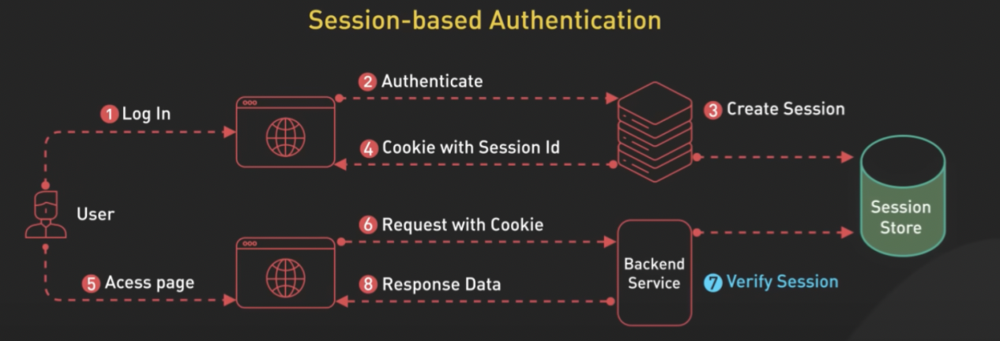

具体流程：</br>

1. 用户输入username和password点击登录向服务端发出 login request ；
2. 服务端根据login request中username查询用户并且验证密码是否正确；
3. 验证无误，产生一个SessionId，并把如下信息存入数据库中（即上图的Session Store）；

   | SessionId | userInfo |
   |------|------|
   | dg75rtgd | { username: winson }  |
   | n$Mmn^X7 | { username: goodBoy }  |
   | ... | ...  |

4. 返回cookie响应；
5. 再次访问页面；
6. 发送页面相关数据请求，这时cookie里已经存在SessionId；
7. 验证Session，服务器端在数据库中查询是否存在SessionId；
8. 验证通过返回请求数据；否则返回未登录提示。


<div id="Token-based"></div>

### 「 2. 基于 Token-based 的 JWT（json web token） 」

 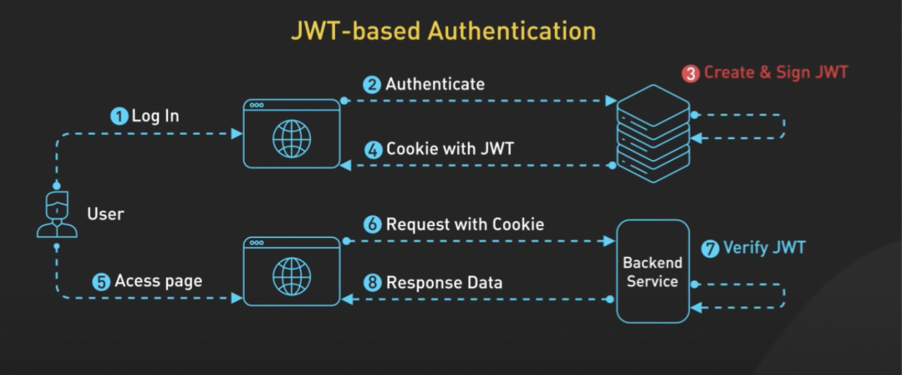

> 说明：Token-based身份验证是一种使用Token来进行用户身份验证的方法，JWT是其中一种实现方式。

具体流程：</br>

1. 用户输入username和password点击登录向服务端发出 login request；</br>
2. 服务端根据login request中username查询用户并且验证密码是否正确；</br>
3. 验证无误，将用户信息按照 JWT(https://jwt.io/) 的规则生成一个 token:

   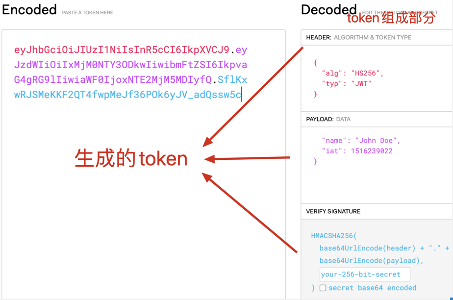

4. 返回cookie响应；
5. 访问页面，发送页面相关数据请求，这时cookie里已经存在token，服务器端验证token是否正确，如果正确
   则是登录用户，没有返回为登录状态。


#### **⚠️⚠️⚠️注意！！！**

上面的4、5步实际使用中一般不放在cookie里，而是通过设置header的方式


用户端：
```js
// 请求拦截器
service.interceptors.request.use(
	(config: InternalAxiosRequestConfig) => {
		if (!SKIP_AUTH.includes(config?.url || "")) {
			const accessToken = localStorage.getItem(TOKEN_KEY);
			if (accessToken) {
				config.headers.Authorization = accessToken; // 这里访问页面时加上token
			}
		}
		return config;
	},
	(error: any) => {
		return Promise.reject(error);
	}
);
```

服务端：

> 说明：Access-Control-Expose-Headers 这个头的作用是告诉浏览器，除了默认可访问的响应头之外，哪些自定义响应头也是可以被JavaScript访问的。（没有设置这个头，即使ctx.set({ authorization: token }); 从header里也是取不出来的）

```js
ctx.set({ "Access-Control-Expose-Headers": "authorization" });
```

一个整体流程：

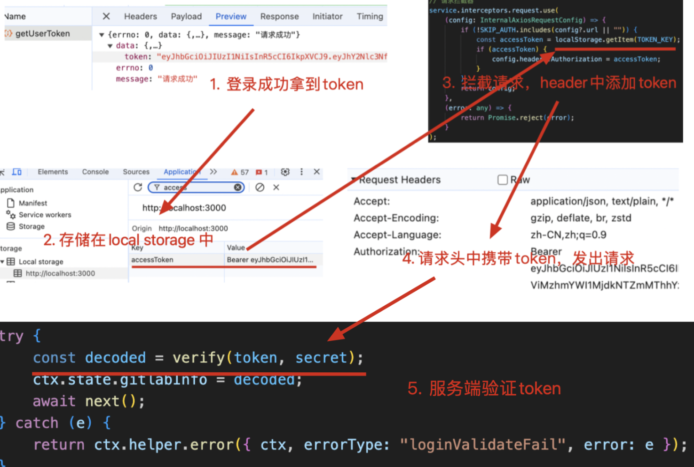


### 「 3. Session和JWT的区别 」

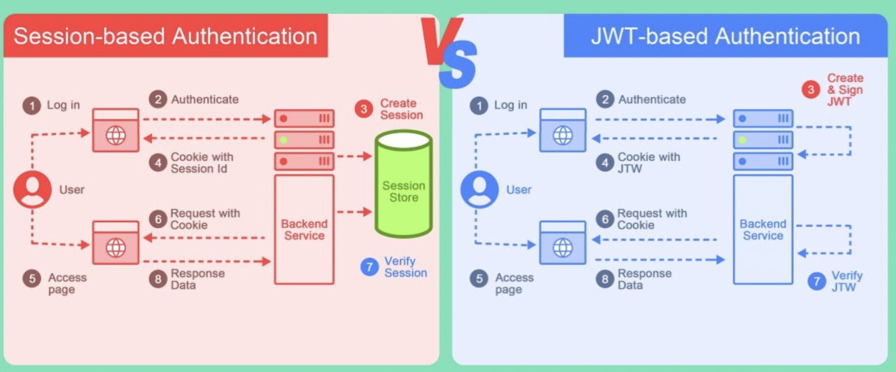

</br>

| Session vs JWT     | 优点 | 缺点 |
|--------------------|------|------|
| session-based authentication       | 1. 服务器可以随时修改或删除会话信息，方便管理用户状态。</br>2.对于小型应用，session 的实现相对简单，使用常见的存储（如内存、数据库）即可。  | 1. 有硬件成本，占用服务器内存。（如上图session store 需要一个外部储存）</br>2.多进程或者多服务器时，同步是个问题。</br>3. 强依赖，服务挂了的话，会话功能完全无法使用。 |
| JWT-based authentication                  | 1. 无状态的，服务器不需要记录任何信息，不占用内存。</br> 2. 多进程，多服务器集群没有影响，易于扩展。</br>3.和服务器端解耦，任何设备都可以生成token。 | 1.无法废弃，如果 JWT 被泄露，攻击者可以使用它进行伪造请求。虽然可以设置过期时间，但一旦签发就无法撤销。</br>2.JWT 通常比 Session ID 大，因为它携带了更多信息，可能导致网络传输开销增加。</br>3.实现和管理 JWT 可能比传统的 Session 更复杂，尤其是在处理签名和验证时。 |

</br>

#### 综上，各有优缺点，自己按实际情况选择，本服务使用 jwt 的方式进行认证。


### 二、用户登录方式介绍

### 「 1. 账号 + 密码 」

> 说明：此种方式涉及到用户输入密码，我们了解下加密方案的选择。

加密方案：

* **明文保存**

  ```js
   {
    name: ‘yezhiwei’,
    password: 987654321
   }
  ```

  这种肯定肯定不可以的，哪一天数据库的数据泄露了，用户的账号可以随意登录，后果可想而之。

* **[md5的方式](https://tool.chinaz.com/tools/md5.aspx)**

  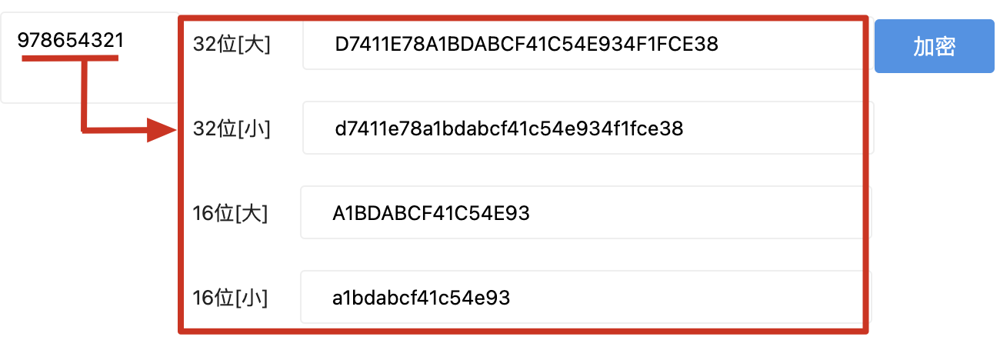

  这种方式已经对密码做了加密处理，存储的不会是明文了，但是被破译的风险较大。

  [彩虹表](http://tool.geekapp.cn/decrypt.php) 了解一下:

   生成大量的密码明文和对应的哈希值，并将它们存储在彩虹表，
   当需要破解一个哈希值对应的密码时，找到彩虹表中对应的哈希值，然后得出对应的明文。

    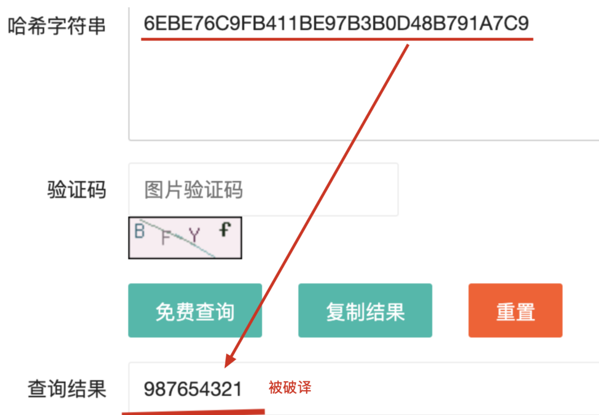

   这种方式也是不安全的。


* **md5 + salt**

  salt 其实就是一个随机字符串。

  ```js
  // 之前的加密方式是
  md5(987654321)
  // 现在的加密方式是，而且密码可以在salt的任何位置插入
  md5(987654321 + 'TnI2jH1BLNs$WYwsE%')   
  ```
  这种方式，加大了彩虹表碰撞的难度，但是，如果salt泄漏了，重新根据salt生成新的彩虹表，一样会有风险。（但较不加盐已经安全了很多）

* **[bcrypt](https://www.bejson.com/encrypt/bcrpyt_encode/)**
  
  > 不可逆的加密算法，同一种明文（plaintext），每次加密后的密文都不一样。</br>
  > 加盐（Salting）：在使用 bcrypt 加密时，会自动生成一个随机的“盐值”（salt），并将盐值和密码一起进行哈希处理。盐值的引入增加了密码的复杂性，使得相同的密码在每次加密时都会产生不同的哈希值。</br>
多轮加密（Key Derivation Function）：bcrypt 使用多轮的哈希计算来增加密码的安全性。通过多次迭代哈希计算，bcrypt 可以大大增加破解密码的难度，从而提高密码的安全性。</br>
工作因子（Work Factor）：bcrypt 允许设置一个“工作因子”（work factor），用于控制哈希计算的复杂度。工作因子的设置越高，计算哈希值所需的时间和资源就越多，进而增加密码破解的难度。
   
    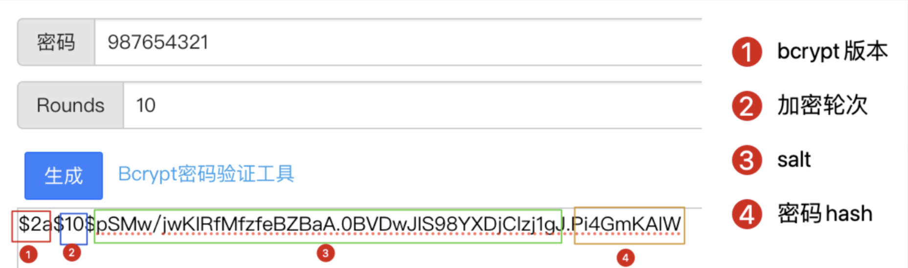


综合上面四种加密方式的分析，我们使用 `bcrypt` 这种最安全的加密方式。

「账号 + 密码」用户创建流程：`/api/users/create`

 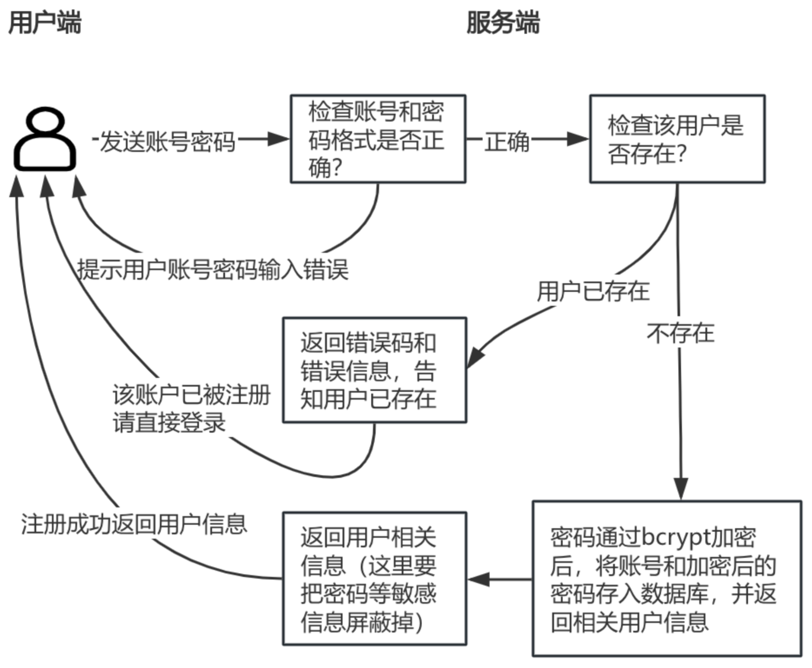

 「账号 + 密码」用户登录流程：`/api/users/login`

  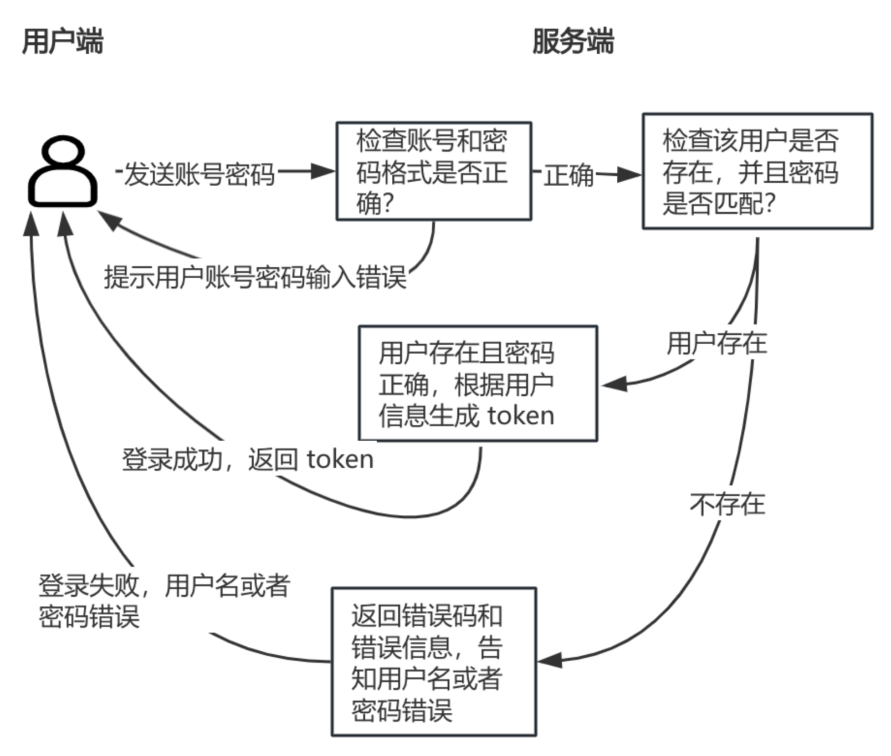


### 「 2. 手机号 + 验证码 」

获取验证码：`/api/users/genVeriCode`

  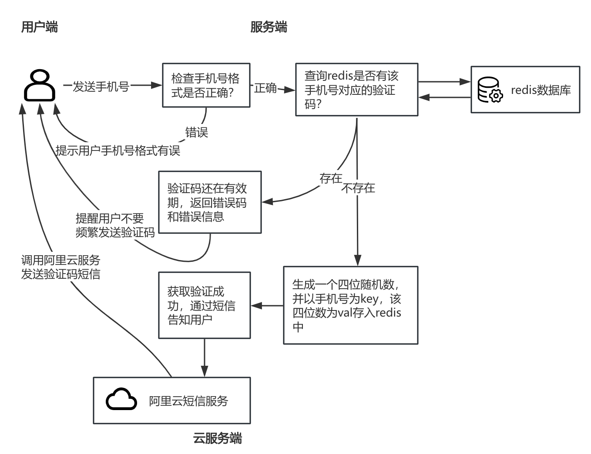


手机号登录：`/api/users/loginByCellphone`

  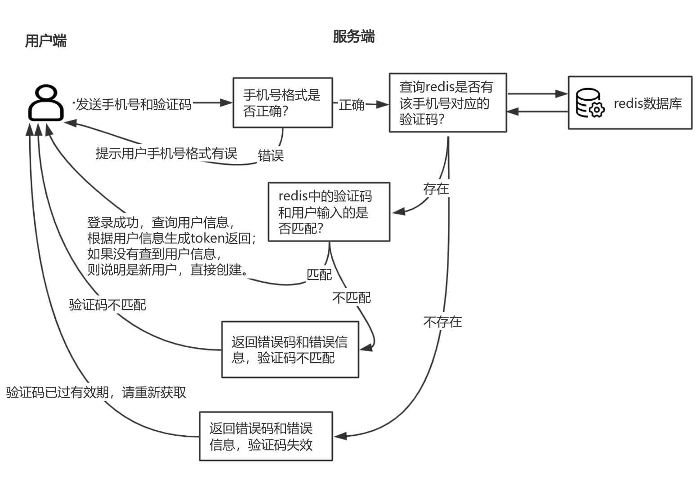

### 「 3. Outh2 」


  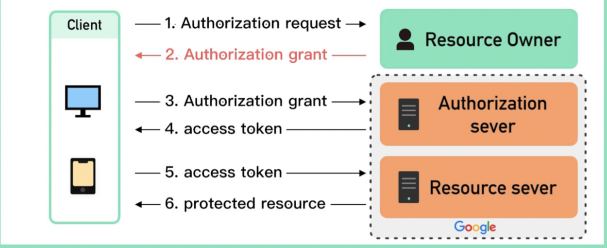


* [gitlab Outh2 接入文档](https://gitlab.cn/docs/jh/api/oauth2.html)
* [gitee Outh2 接入文档](https://gitee.com/api/v5/oauth_doc#/)
* [github Outh2 接入文档](https://docs.github.com/zh/apps/oauth-apps/building-oauth-apps/authorizing-oauth-apps)

> 本服务中 Outh2 用 gitee 授权，我在自己的实际项目中用的是gitlab授权，方式都大同小异。

**以 gitlab 为例**：

> 因为我们的服务需要使用gitlab登录，所以首先进入gitlab创建一个新的应用，并且授予这个新应用一个使用gitlab的权限范围，这个新应用对应的就是就是我们这个用户认证的服务端：


   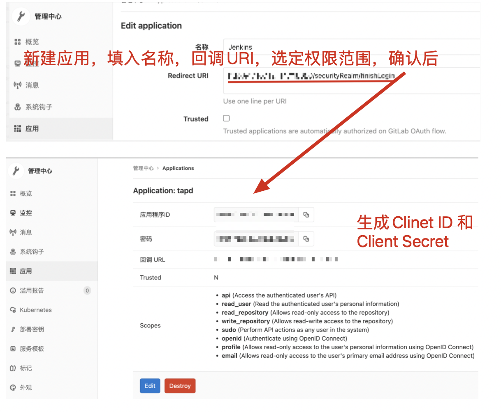

</br>

> 注册完应用后，看下整体的授权流程：

   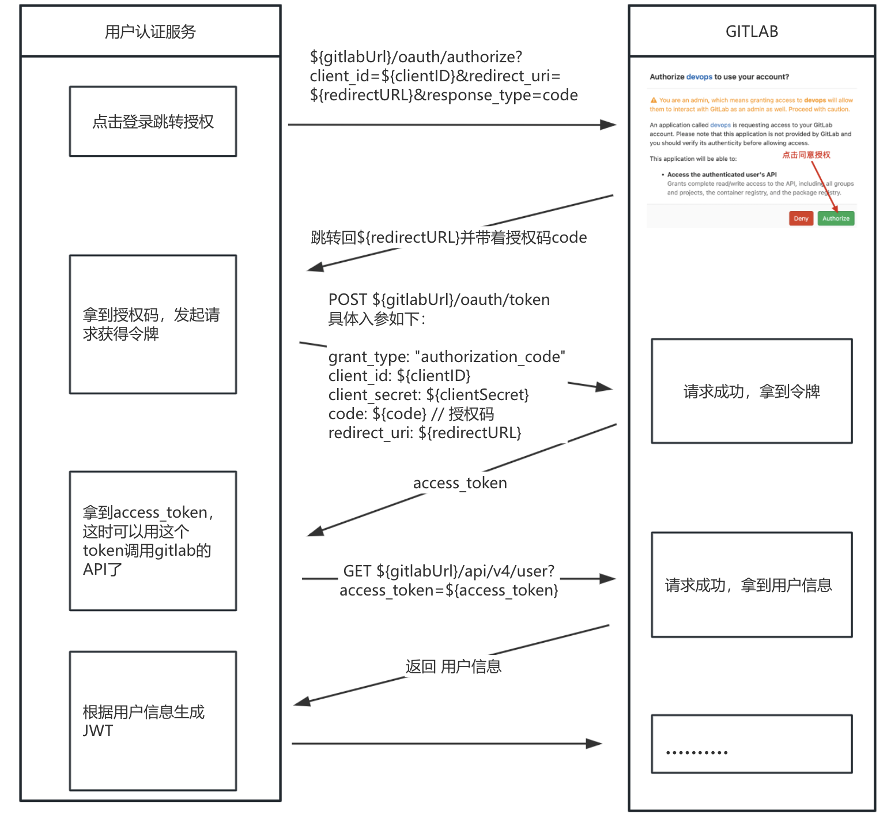

1. 点击跳转gitlab授权地址，会有弹框出现，想你确认是否授权。
2. 确认授权后，会跳转回之前应用中配置的回调URI，并且连接上拼上了授权码。
3. 拿到授权码后，想gitlab服务再次发出请求，置换令牌。
4. 成功拿到令牌后，就有了可以调用 gitlab api 的能力，调用获取gitlab用户信息。
5. 根据拿到的用户信息，生成JWT，返回用户端。
6. 后面的请求头里都会带上 JWT。（这里具体实现  <a style="text-decoration:none;" href="#Token-based">「 2. 基于 Token-based 的 JWT（json web token） 」</a>）这个部分

### 附录:

部署上线：

1. 采用方式： github actions + docker-compose + aliyun ACR 镜像。

2. 触发条件：git push --tags


 * [GitHub Actions](https://docs.github.com/zh/actions )

   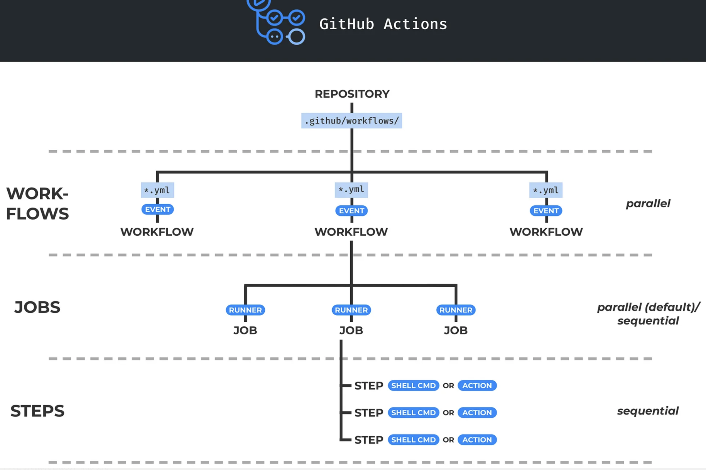


* [阿里云镜像服务](https://cr.console.aliyun.com/cn-shenzhen/instances)（使用个人版即可）
  

  


